# Amazon Returns & AI Vision Grading Platform 🚚🤖

> **Enterprise-Grade Automated Reverse Logistics, Multi-View AI Condition Assessment, and Circular Economy Routing Platform**

[](https://amazon-hackon-livid.vercel.app/)
[](https://amazon-grading-backend.onrender.com/health)
[](https://ai-grading-dlga.onrender.com)
[](https://supabase.com/)
[](LICENSE)

---

## 🌐 Live Production Deployment

- 🖥️ **Web Application (Frontend)**: [https://amazon-hackon-livid.vercel.app/](https://amazon-hackon-livid.vercel.app/)
- ⚙️ **Core Backend API**: [https://amazon-grading-backend.onrender.com](https://amazon-grading-backend.onrender.com/health)
- 🤖 **AI Vision Microservice**: [https://ai-grading-dlga.onrender.com](https://ai-grading-dlga.onrender.com)
- 📁 **GitHub Repository**: [https://github.com/Abhay-2309/AI-Grading.git](https://github.com/Abhay-2309/AI-Grading.git)

---

## 📌 Executive Summary

Modern e-commerce platforms handle millions of product returns daily, incurring billions in logistics overheads, manual processing delays, and return fraud.

The **Amazon Returns & AI Grading Platform** is a production-ready, microservices-based logistics platform designed to automate item condition grading, field verification, fraud mitigation, and circular economy inventory routing.

When a customer initiates a return, multi-angle physical evidence is analyzed by a **Multi-Tier Computer Vision Pipeline** powered entirely by **our own locally-hosted AI models** — a custom-trained **YOLO11** structural defect detection model (fine-tuned in-house as `returniverse_engine`) and a locally-deployed **Moondream2 VLM** for semantic auditing and category verification. Using a **Deterministic Rules & Band-Edge Voting Engine**, items are graded (`A+` to `F`), assigned a confidence score, and automatically routed to **Restock**, **Refurbish**, **P2P Resale (MarketConnect)**, **NGO Donation (MarketConnect Cares)**, or **Amazon Renewed** for certified refurbished sales. If the local Python engine is unavailable, a circuit breaker falls over to **Gemma-4** as a last-resort cloud fallback — but the primary inference path is 100% our own models.

---

## 🏗️ Enterprise System Architecture

```
                               ┌────────────────────────────────────────┐
                               │       Frontend SPA (Vite / React)      │
                               │    https://amazon-hackon.vercel.app    │
                               └───────────────────┬────────────────────┘
                                                   │ HTTPS / REST
                                                   ▼
                               ┌────────────────────────────────────────┐
                               │       Backend API (Express.js)         │
                               │   https://amazon-grading.onrender.com  │
                               └─────────┬────────────────────┬─────────┘
                                         │                    │
                 Prisma ORM / PostgreSQL │                    │ Server-to-Server Proxy
                 (Supabase Session Pool) │                    │ (Multipart / JSON)
                                         ▼                    ▼
                             ┌───────────────────┐    ┌───────────────────┐
                             │    Supabase DB    │    │  AI Microservice  │
                             │  (PostgreSQL 15)  │    │  (Fastify / TS)   │
                             └───────────────────┘    └─────────┬─────────┘
                                                                │
                                            ┌───────────────────┼───────────────────┐
                                            ▼                   ▼                   ▼
                                    ┌───────────────┐   ┌───────────────┐   ┌─────────────────────┐
                                    │    AWS S3     │   │ AWS DynamoDB  │   │  Python AI Engine   │
                                    │(Photo Bucket) │   │ (State Audit) │   │ (FastAPI / Port 8000│
                                    └───────────────┘   └───────────────┘   └──────────┬──────────┘
                                                                                        │
                                                                         ┌──────────────┴──────────────┐
                                                                         ▼                             ▼
                                                                ┌─────────────────┐       ┌──────────────────────┐
                                                                │  Custom YOLO11  │       │   Moondream2 VLM     │
                                                                │ returniverse_   │       │  (Locally Deployed   │
                                                                │ engine (ours)   │       │   from local weights)│
                                                                └─────────────────┘       └──────────────────────┘
                                                                                                     │
                                                                                   Fallback Only (Circuit Breaker)
                                                                                                     ▼
                                                                                        ┌────────────────────┐
                                                                                        │    Gemma-4 VLM     │
                                                                                        │  (Cloud Fallback   │
                                                                                        │   via Google API)  │
                                                                                        └────────────────────┘
```

### Key Architectural Constraints & Guarantees
1. **Backend Gateway & Single Authority**: Frontend never connects directly to the AI microservice, Python engine, or AWS resources. The Backend acts as the API Gateway, handling authentication, business logic, and database persistence.
2. **Stateless AI Processing**: The AI microservice (`AI1`) accepts multipart requests, validates image quality, archives original and processed images to S3, updates DynamoDB audit records, runs async vision analysis, and returns presigned image links.
3. **Our Own Models — No External Vision APIs in the Hot Path**: All production image analysis is performed by our own locally-hosted YOLO11 defect detection model and Moondream2 VLM. No third-party vision API (e.g., OpenAI Vision, Google Vision AI, Gemini) is used in the primary grading pipeline.
4. **Resilience & Circuit Breaker**: If the primary local Python AI engine (YOLO11 + Moondream2) fails or encounters hardware bottlenecks, a Circuit Breaker pattern automatically fails over to **Gemma-4** (cloud), guaranteeing zero user disruption.
5. **Stuck-Request Sweeper**: A background service sweeps DynamoDB every 60 seconds to detect any requests stuck in `ANALYZING` state for more than 15 minutes, automatically transitioning them to `FAILED` to prevent frontend polling locks.

---

## 🧠 Our AI Models

This platform does **not** rely on generic cloud vision APIs for grading. All visual intelligence is built in-house:

### 🔬 Custom YOLO11 — `returniverse_engine` (Structural Defect Detection)
- **Architecture**: YOLO11s (small variant), custom fine-tuned from base weights
- **Training Run**: `returniverse_engine/production_run_v1-4` (weights: `best.pt`)
- **Task**: Object detection — localizes and classifies physical defects in product images
- **Defect Classes Detected**:
  - `crack` — screen cracks, body cracks
  - `dent` — physical deformations
  - `scratch` — surface abrasions
  - `stain` — liquid or dirt stains
  - `pcb_defect` — internal PCB damage (electronics)
  - `structural_damage` — severe frame damage
  - `hole_tear` — fabric / packaging tears
- **Output**: Bounding boxes with class labels, confidence scores, and normalized coordinates

### 🌙 Moondream2 VLM — Locally Deployed (Semantic Auditing)
- **Architecture**: Moondream2 (vikhyatk/moondream2, revision: `2024-08-26`)
- **Hosting**: Fully local — weights loaded from `local_moondream/` directory (or downloaded once from HuggingFace Hub with architecture code sourced from our `moondream_src/` folder to avoid remote trust dependencies)
- **Task**: Visual Question Answering (VQA) — asks structured semantic questions about each image view to produce defect flags
- **Semantic Checks Performed**:
  - Does the item match the claimed product category?
  - Are there signs of heavy dirt, water damage, or tampering?
  - Is the image quality sufficient for grading?
  - Are there visible functional/structural failure signs?
- **Compatibility**: Runs with a custom architecture patch (`moondream_src/`) and GenerationMixin injection for compatibility with `transformers >= 4.50`

### ⚡ Gemma-4 (Cloud Fallback Only)
- **Model**: `gemma-4-26b-a4b-it` via Google Generative AI SDK
- **Role**: Secondary fallback only — activated automatically by the circuit breaker when the local Python AI engine is unavailable (failure threshold: 5 consecutive failures, cooldown: 120 seconds)
- **Not used in normal operation** — the primary pipeline always routes through our own YOLO11 + Moondream2 stack

---

## 💻 Tech Stack & Component Ecosystem

| Component | Technology | Version | Purpose |
|---|---|---|---|
| **Frontend** | React 19, Vite 8, Tailwind CSS 4 | `19.2.7` / `8.1.2` | Single Page Web Application (8 Integrated Portals) |
| **Backend API** | Node.js, Express.js, Prisma ORM | `20+` / `4.19.2` | Core business logic, data persistence, API proxy |
| **AI Microservice** | Fastify, TypeScript, Sharp, Zod | `5.0.0` / `5.7.2` | Image validation, S3 storage, state orchestration |
| **Python AI Engine** | FastAPI, Uvicorn, PyTorch | `0.109+` / `2.2+` | Primary local vision pipeline hosting our own YOLO11 & Moondream2 |
| **Our Defect Model** | Custom YOLO11s (`returniverse_engine`) | Fine-Tuned | In-house structural defect detection — bounding-box inference across 7 defect classes |
| **Our VLM** | Moondream2 (locally hosted) | `2024-08-26` | Locally-deployed VLM for semantic auditing, category verification & QA |
| **Cloud Fallback** | Gemma-4 (`gemma-4-26b-a4b-it`) | Google Generative AI | Last-resort circuit-breaker fallback — not used in the primary grading path |
| **Database** | PostgreSQL (Supabase) | `15.0` | Primary relational database (Prisma Client) |
| **Cloud Storage** | AWS S3 & AWS DynamoDB | `@aws-sdk/v3` | Multi-variant image hosting & async execution logging |

---

## 🎯 The 8 Integrated User Portals

The application features an integrated multi-persona dashboard accessible from a central Gateway:

| Portal | Role & Purpose | Key Technical Features |
|---|---|---|
| **👤 Customer Portal** | Initiate returns & upload evidence | Required multi-angle upload, interactive condition survey, real-time AI report, instant refund estimate |
| **🚚 Pickup Agent App** | Field agent verification app | Daily route management, field grade verification, disagreement flagging, end-of-shift accuracy metric |
| **🛡️ Operations Hub** | Fraud guard & manual review console | AI-vs-Agent disagreement queue, risk scoring, automated inventory routing, agent leaderboard |
| **👗 Fitting & Try-On** | Return prevention suite | AI Virtual Try-On, shoe size finder (powered by past purchase history) |
| **🛍️ MarketConnect P2P** | Graded return resale marketplace | Peer-to-peer resale of B/C/D grade returns, seller chat, green credit unlocks |
| **✨ Amazon Renewed** | Official refurbished store | Certified resale of graded items (A+/A/B) backed by Amazon Renewed Guarantee |
| **💚 MarketConnect Cares** | NGO donation pipeline | Direct product donations to verified NGO campaigns, Green Credit rewards |
| **🏛️ NGO Dashboard** | NGO campaign administration | Post item needs, track campaign progress, receive verified donation shipments |

---

## 🔬 AI Grading & Rules Engine Pipeline

The AI microservice combines our own deep vision analysis with a deterministic rules engine to prevent AI hallucinations and guarantee grading fairness:

```mermaid
flowchart LR
    A["📸 Multi-Angle Photos"] --> B["Intake & Quality Check"]
    B --> C["Upload to S3 & DynamoDB"]
    C --> D["Custom YOLO11 Defect Pass<br/>(returniverse_engine)"]
    D --> E["Moondream2 VLM Audit<br/>(locally hosted)"]
    E --> F["N=3 Majority Voting<br/>(auto on band-edge)"]
    F --> G["Cross-View Dedup"]
    G --> H["Deterministic Rules Engine"]
    H --> I["Grade Cap Rules<br/>(Water→F, Crack→D)"]
    I --> J["Final Report & S3 Presigned URLs"]
```



### 1. Multi-Angle Verification
Requires category-specific required angles (e.g. 6-view front/back/left/right/top/bottom for electronics, 2-view front/back for apparel).

### 2. Multi-Pass Majority Voting ($N=3$)
To prevent single-inference variance, 3 detection passes run concurrently. Defect detections are merged using majority voting logic. For CPU-only inference, the default is N=1 (fast path), with automatic promotion to N=3 when a score falls near a grade-band boundary.

### 3. Band-Edge Boundary Re-Run
If an item's score lands within $\pm 3$ points of a letter grade boundary (e.g., score of 89 near the 88 boundary between A and B+), an additional voting pass triggers automatically.

### 4. Hard Grade Caps
Raw model output cannot override strict physical safety & quality rules:
- ❌ **Water Damage** $\rightarrow$ Forced Grade `F`
- ❌ **High/Critical Screen Crack or Tampering** $\rightarrow$ Forced Grade `D`
- ❌ **Customer-Admitted Functional Failure** $\rightarrow$ Forced Grade `C`
- ❌ **Low Photo Quality ($<50\%$)** $\rightarrow$ Capped at `B` + Flagged for Human Review

---

## 🗄️ Database Entity Schema (Prisma PostgreSQL)

```prisma
datasource db {
  provider = "postgresql"
  url      = env("DATABASE_URL")
}

model Profile {
  id                String            @id @default(uuid())
  email             String            @unique
  fullName          String?
  greenCredits      Int               @default(320)
  treesPlanted      Int               @default(14)
  causesHelped      Int               @default(8)
  returns           Return[]
  p2pProducts       P2pProduct[]
  donationHistory   DonationHistory[]
}

model Return {
  id                    String    @id
  itemName              String
  category              String
  price                 Decimal   @db.Decimal(10, 2)
  status                String    @default("Pending")
  userGrade             String?
  userConfidence        String?
  defects               Json      @default("[]")
  agentGrade            String    @default("")
  routing               String?   // Restock, Refurbish, P2P, Donation, Renewed
  aiRequestId           String?
  aiStatus              String?
  aiRequiresHumanReview Boolean   @default(false)
  createdAt             DateTime  @default(now())
}
```

---

## ⚡ API Endpoints Reference

### Core Backend (`:5000`)
- `GET  /health` - Health check endpoint
- `GET  /api/returns` - List all return records
- `PUT  /api/returns/:id` - Update return status / agent grade
- `POST /api/returns/submit` - Finalize customer return
- `POST /api/grading/:returnId/submit` - Submit photos to AI grading proxy
- `GET  /api/grading/:returnId/status` - Poll grading execution status
- `GET  /api/grading/:returnId/result` - Fetch complete AI report & presigned image URLs
- `GET  /api/p2p/products` - List peer-to-peer resale products
- `POST /api/donations/donate` - Submit item donation & earn Green Credits

### AI Microservice (`:3000`)
- `POST /grade` - Multipart intake, validation, S3 storage, async pipeline enqueue
- `GET  /status/:requestId` - Query current status (`VALIDATED`, `ANALYZING`, `GRADED`, `COMPLETED`, `FAILED`)
- `GET  /result/:requestId` - Fetch final rubric report + presigned S3 URLs

### Python AI Engine (`:8000`)
- `GET  /health` - Reports YOLO11 and Moondream2 load status
- `POST /api/v1/intake` - Dual-pathway intake controller (order-based or product-name-based)
- `POST /api/v1/evaluate/disposition` - Runs our YOLO11 bounding-box inference + Moondream2 VLM defect validation, category verification, deterministic grading and NRV routing

---

## 🚀 Local Development Setup

### 1. Prerequisites
- Node.js $\ge 20.0.0$
- Python $\ge 3.10$ with PyTorch (CPU or CUDA)
- AWS account with S3 & DynamoDB access
- Supabase project or local PostgreSQL instance
- (Optional) A Gemma API key — only needed for circuit-breaker fallback; not required for primary operation

### 2. Model Weights

The Python AI Engine uses two locally-hosted models:

**YOLO11 (custom-trained):** The fine-tuned weights are loaded from:
```
Grading-pipeline-main/runs/detect/returniverse_engine/production_run_v1-4/weights/best.pt
```

**Moondream2 VLM:** Pre-place the model weights in:
```
Grading-pipeline-main/local_moondream/model.safetensors
```
If `local_moondream/model.safetensors` is missing, the engine automatically downloads the weights once from `vikhyatk/moondream2` (revision `2024-08-26`) on HuggingFace Hub. The local model architecture source is always read from `Grading-pipeline-main/moondream_src/` to avoid remote code execution.

### 3. Environment Setup

#### `Backend/.env`
```env
PORT=5000
DATABASE_URL="postgresql://postgres:<password>@<host>:5432/postgres?schema=public"
AI1_BASE_URL="http://localhost:3000"
```

#### `AI1/.env`
```env
PORT=3000
NODE_ENV=development
AWS_REGION=ap-south-1
AWS_ACCESS_KEY_ID=your_aws_key
AWS_SECRET_ACCESS_KEY=your_aws_secret
S3_BUCKET_NAME=ai-grading-service-storage-12345
DYNAMODB_TABLE_NAME=AIGradingRequests

# Primary AI engine (our own YOLO11 + Moondream2)
PYTHON_AI_ENGINE_URL=http://127.0.0.1:8000
MODEL_TIMEOUT_MS=400000

# Gemma fallback (only needed if local engine is unavailable)
GEMMA_API_KEY=your_gemma_key
GEMMA_MODEL=gemma-4-26b-a4b-it

# Circuit breaker
CIRCUIT_BREAKER_FAILURE_THRESHOLD=5
CIRCUIT_BREAKER_COOLDOWN_MS=120000
```

#### `Frontend/.env.local`
```env
VITE_API_BASE_URL=http://localhost:5000
```

### 4. Starting Services

Open four terminal windows to start all components:

```bash
# Terminal 1: Python AI Engine (YOLO11 + Moondream2)
cd Grading-pipeline-main
.\env\Scripts\python.exe -m uvicorn main:app --port 8000 --host 127.0.0.1

# Terminal 2: AI Microservice (orchestrator + S3/DynamoDB)
cd AI1
npm install
npm run dev

# Terminal 3: Core Backend API
cd Backend
npm install
npx prisma generate
npx prisma db push
node prisma/seed.js
npm run dev

# Terminal 4: Frontend Web Application
cd Frontend
npm install
npm run dev
```

Navigate to **http://localhost:5173** in your web browser.

> **Note on CPU Inference**: Running Moondream2 VLM on CPU-only hardware takes approximately 158 seconds per image view. For a 6-view electronics return this means ~16 minutes total. GPU (CUDA/MPS) acceleration is auto-detected and significantly reduces this time.

---

## 🛡️ Security & Reliability Provisions

1. **Environment Isolation**: Production credentials (AWS, Supabase, Gemma API keys) are strictly managed via platform environment variables (Vercel & Render Secrets).
2. **No External Vision API in Hot Path**: Grading is performed entirely by our own locally-hosted models. No customer product images are sent to external vision APIs during normal operation.
3. **Automated Reconnection**: Database pooler strings use explicit connection & pool timeouts to handle transient serverless drops.
4. **Graceful Shutdown**: The Fastify AI service intercepts `SIGTERM` and `SIGINT` signals to allow active grading pipelines to finish before exiting.

---

## 📄 License & Ownership

Developed for the **Amazon HackOn Logistics & AI Innovation Challenge**. Distributed under the **MIT License**.
